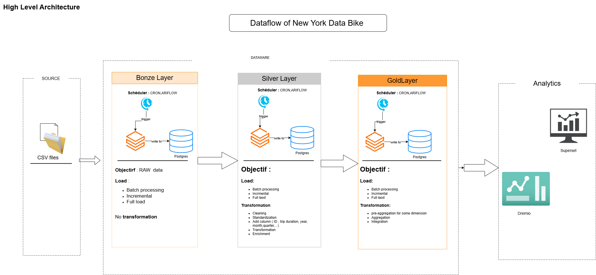
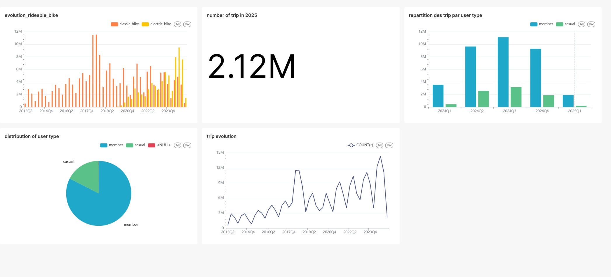

# Project : NYC Bike Trips Lakehouse
## Overview
This is a project that aim to implement a datawarehouse that collection to aggregate and ploting some graph 



## Description of the Stak 

| Layer                      | Tools & Components                        | Key Role                                                 |
| -------------------------- | ----------------------------------------- | -------------------------------------------------------- |
| 1. Ingestion               | MinIO, Docker                             | Raw data landing zone                                    |
| 2. ETL & Transformation    | PySpark, Python                           | Medallion architecture pipeline (Bronze → Silver → Gold) |
| 3. Orchestration           | Apache Airflow, PostgreSQL                | Job scheduling, dependency management                    |
| 4. Storage & Versioning    | Apache Iceberg, Apache Nessie, PostgreSQL | ACID tables, schema evolution, time travel               |
| 5. Query                   | Dremio                                    | SQL interface over Iceberg tables                        |
| 6. Visualization           | Apache Superset                           | Dashboards and interactive analytics                     |
| 7. Infrastructure & DevOps | Docker Compose                            | Local deployment and development environment             |


## Dashbord on Superset



## Setup the docker compose 

```bash


```

