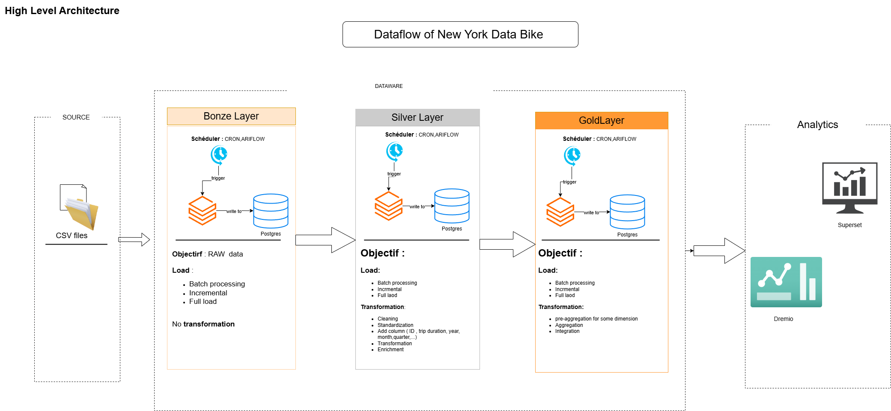
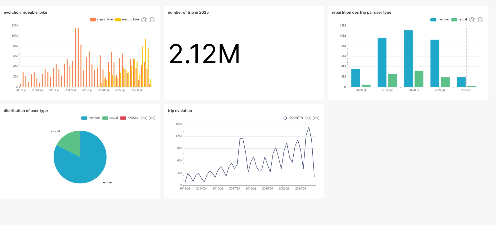

# Project : NYC Bike Trips Lakehouse
## Overview
This is a project that aim to implement a datawarehouse that collection to aggregate and ploting some graph 



## Description of the Stak 

| Layer                      | Tools & Components                        | Key Role                                                 |
| -------------------------- | ----------------------------------------- | -------------------------------------------------------- |
| 1. Ingestion               | MinIO, Docker                             | Raw data landing zone                                    |
| 2. ETL & Transformation    | PySpark, Python                           | Medallion architecture pipeline (Bronze → Silver → Gold) |
| 3. Orchestration           | Apache Airflow, PostgreSQL                | Job scheduling, dependency management                    |
| 4. Storage & Versioning    | Apache Iceberg, Apache Nessie, PostgreSQL | ACID tables, schema evolution, time travel               |
| 5. Query                   | Dremio                                    | SQL interface over Iceberg tables                        |
| 6. Visualization           | Apache Superset                           | Dashboards and interactive analytics                     |
| 7. Infrastructure & DevOps | Docker Compose                            | Local deployment and development environment             |


## Dashbord on Superset



## Setup the docker compose 

```bash

```


## Notebook command note 

```bash 
export PYTHONPATH="$PYTHONPATH:/pyspark_etl_pipeline/src"

```


```sql
CREATE TABLE season_stats (
    year INTEGER,
    player TEXT,
    pos TEXT,
    age INTEGER,
    tm TEXT,
    g INTEGER,
    gs INTEGER,
    mp REAL,
    per REAL,
    ts REAL,
    threepar REAL,
    ftr REAL,
    orb_pct REAL,
    drb_pct REAL,
    trb_pct REAL,
    ast_pct REAL,
    stl_pct REAL,
    blk_pct REAL,
    tov_pct REAL,
    usg REAL,
    blank1 TEXT,
    ows REAL,
    dws REAL,
    ws REAL,
    ws48 REAL,
    blank2 TEXT,
    obpm REAL,
    dbpm REAL,
    bpm REAL,
    vorp REAL,
    fg INTEGER,
    fga INTEGER,
    fg_pct REAL,
    threep INTEGER,
    threepa INTEGER,
    threep_pct REAL,
    twop INTEGER,
    twopa INTEGER,
    twop_pct REAL,
    efg_pct REAL,
    ft INTEGER,
    fta INTEGER,
    ft_pct REAL,
    orb INTEGER,
    drb INTEGER,
    trb INTEGER,
    ast INTEGER,
    stl INTEGER,
    blk INTEGER,
    tov INTEGER,
    pf INTEGER,
    pts INTEGER
);


```
```bash
psql -U userdb -d postgres -c "\copy season_stats FROM '/nba_stats/Seasons_Stats.csv' CSV HEADER DELIMITER ','"

```

,Year,Player,Pos,Age,Tm,G,GS,MP,PER,TS%,3PAr,FTr,ORB%,DRB%,TRB%,AST%,STL%,BLK%,TOV%,USG%,blanl,OWS,DWS,WS,WS/48,blank2,OBPM,DBPM,BPM,VORP,FG,FGA,FG%,3P,3PA,3P%,2P,2PA,2P%,eFG%,FT,FTA,FT%,ORB,DRB,TRB,AST,STL,BLK,TOV,PF,PTS


```sql

-- PostgreSQL CREATE TABLE script for seasons_stats
-- Created from Databricks table: workspace.default.seasons_stats
-- Description: Player statistics for various seasons

CREATE TABLE seasons_stats (
    "Year" BIGINT,
    "Player" TEXT,
    "Pos" TEXT,
    "Age" BIGINT,
    "Tm" TEXT,
    "G" BIGINT,
    "GS" BIGINT,
    "MP" BIGINT,
    "PER" DOUBLE PRECISION,
    "TS%" DOUBLE PRECISION,
    "3PAr" DOUBLE PRECISION,
    "FTr" DOUBLE PRECISION,
    "ORB%" DOUBLE PRECISION,
    "DRB%" DOUBLE PRECISION,
    "TRB%" DOUBLE PRECISION,
    "AST%" DOUBLE PRECISION,
    "STL%" DOUBLE PRECISION,
    "BLK%" DOUBLE PRECISION,
    "TOV%" DOUBLE PRECISION,
    "USG%" DOUBLE PRECISION,
    "blanl" TEXT,
    "OWS" DOUBLE PRECISION,
    "DWS" DOUBLE PRECISION,
    "WS" DOUBLE PRECISION,
    "WS/48" DOUBLE PRECISION,
    "blank2" TEXT,
    "OBPM" DOUBLE PRECISION,
    "DBPM" DOUBLE PRECISION,
    "BPM" DOUBLE PRECISION,
    "VORP" DOUBLE PRECISION,
    "FG" BIGINT,
    "FGA" BIGINT,
    "FG%" DOUBLE PRECISION,
    "3P" BIGINT,
    "3PA" BIGINT,
    "3P%" DOUBLE PRECISION,
    "2P" BIGINT,
    "2PA" BIGINT,
    "2P%" DOUBLE PRECISION,
    "eFG%" DOUBLE PRECISION,
    "FT" BIGINT,
    "FTA" BIGINT,
    "FT%" DOUBLE PRECISION,
    "ORB" BIGINT,
    "DRB" BIGINT,
    "TRB" BIGINT,
    "AST" BIGINT,
    "STL" BIGINT,
    "BLK" BIGINT,
    "TOV" BIGINT,
    "PF" BIGINT,
    "PTS" BIGINT
);

-- Optional: Add indexes for commonly queried columns
CREATE INDEX idx_seasons_stats_player ON seasons_stats("Player");
CREATE INDEX idx_seasons_stats_year ON seasons_stats("Year");
CREATE INDEX idx_seasons_stats_tm ON seasons_stats("Tm");

-- Optional: Add comments
COMMENT ON TABLE seasons_stats IS 'Player statistics for various basketball seasons including performance metrics and game statistics';
```


```md
Player Information:

    Year (bigint)
    Player (string)
    Pos (string) - Position
    Age (bigint)
    Tm (string) - Team
    G (bigint) - Games
    GS (bigint) - Games Started
    MP (bigint) - Minutes Played

Advanced Metrics:

    PER (double) - Player Efficiency Rating
    TS% (double) - True Shooting %
    3PAr (double) - 3-Point Attempt Rate
    FTr (double) - Free Throw Rate
    ORB% (double) - Offensive Rebound %
    DRB% (double) - Defensive Rebound %
    TRB% (double) - Total Rebound %
    AST% (double) - Assist %
    STL% (double) - Steal %
    BLK% (double) - Block %
    TOV% (double) - Turnover %
    USG% (double) - Usage %

Win Shares:

    blanl (string)
    OWS (double) - Offensive Win Shares
    DWS (double) - Defensive Win Shares
    WS (double) - Win Shares
    WS/48 (double) - Win Shares per 48 minutes

Box Plus/Minus:

    blank2 (string)
    OBPM (double) - Offensive Box Plus/Minus
    DBPM (double) - Defensive Box Plus/Minus
    BPM (double) - Box Plus/Minus
    VORP (double) - Value Over Replacement Player

Shooting Statistics:

    FG (bigint) - Field Goals
    FGA (bigint) - Field Goal Attempts
    FG% (double) - Field Goal %
    3P (bigint) - 3-Pointers Made
    3PA (bigint) - 3-Point Attempts
    3P% (double) - 3-Point %
    2P (bigint) - 2-Pointers Made
    2PA (bigint) - 2-Point Attempts
    2P% (double) - 2-Point %
    eFG% (double) - Effective Field Goal %
    FT (bigint) - Free Throws
    FTA (bigint) - Free Throw Attempts
    FT% (double) - Free Throw %

Counting Stats:

    ORB (bigint) - Offensive Rebounds
    DRB (bigint) - Defensive Rebounds
    TRB (bigint) - Total Rebounds
    AST (bigint) - Assists
    STL (bigint) - Steals
    BLK (bigint) - Blocks
    TOV (bigint) - Turnovers
    PF (bigint) - Personal Fouls
    PTS (bigint) - Points


```

```sql

-- note of syntax of collection type in databricks

-- In table definition
CREATE TABLE players (
    id INT,
    stats STRUCT<season: INT, pos: STRING, games: INT>
);

-- Creating STRUCT values
SELECT 
    Player,
    STRUCT(Year AS season, Pos, G AS games) AS stats
FROM seasons_stats
LIMIT 3;

-- Accessing STRUCT fields
SELECT stats.season, stats.pos FROM players;


------------------------------------------

-- In table definition
CREATE TABLE team_roster (
    team_name STRING,
    players ARRAY<STRING>
);

-- Creating ARRAY values

SELECT 
    Tm,
    COLLECT_LIST(Player) AS roster
FROM seasons_stats
WHERE Year = 2015
GROUP BY Tm
LIMIT 3;

-- Accessing ARRAY elements (0-indexed)

SELECT players[0] FROM team_roster;

---------------------------------------------------------

-- In table definition
CREATE TABLE player_metadata (
    player_id INT,
    attributes MAP<STRING, STRING>
);

-- Creating MAP values
SELECT 
    Player,
    MAP('position', Pos, 'team', Tm) AS attributes
FROM seasons_stats
LIMIT 3;

-- Accessing MAP values
SELECT attributes['position'] FROM player_metadata;


-------------------------------------------------------------------

CREATE TABLE complex_stats (
    player STRING,
    season_stats ARRAY<STRUCT<year: INT, pts: INT>>,
    career_highlights MAP<STRING, INT>
);


```

## dump command restoration for nba_stats

```sql

pg_restore -c --if-exists -U <your-username> -d postgres data.dump

pg_restore -U [username] -d [db_name] -h [host] -p [port] data.dump 

```

